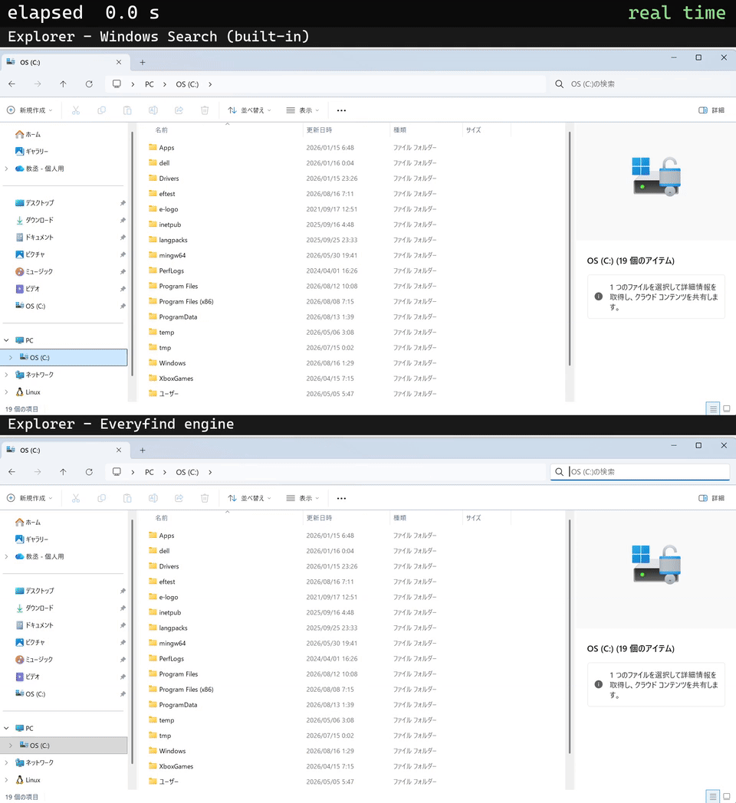
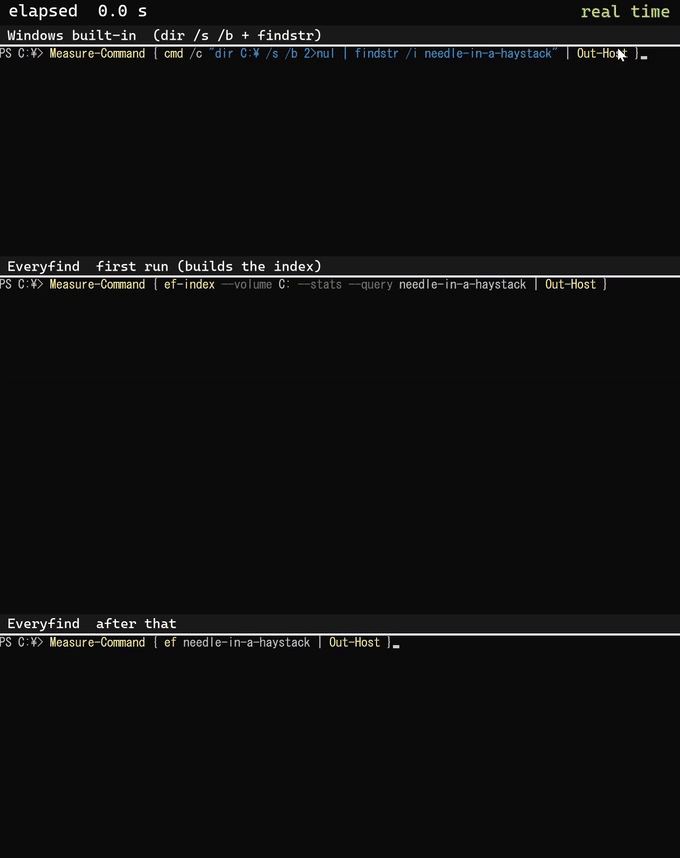

# Everyfind

> ぼくのかんがえた、さいきょうの検索ツール

[English](README.md)

**Windows のファイル名を、ターミナルで即座に検索。** NTFS ボリュームの索引をメモリ上に持ち続けるので、数百万件のファイル名をミリ秒で引けます。ディスク使用量も同じ索引から即答します。

[](https://github.com/kyo5uke/everyfind/actions/workflows/ci.yml) [](#ライセンス)


```text
ef notes            # 名前に "notes" を含む全ファイル・フォルダ — 約 15 ms
ef                  # 対話画面: 打ちながら絞り込み、Enter でパスを出力
ef du C:\Users      # C:\Users 以下で容量を食っているもの — 索引から即答
```

仕組みは [Everything](https://www.voidtools.com/)（voidtools）と同じです。NTFS のマスターファイルテーブル（MFT）を直接読んで数秒で全ファイル名の索引を作り、あとは USN 変更ジャーナルを追って最新に保ちます。検索のためにディレクトリを歩くことはありません。さらに任意で、[エクスプローラーの検索をこの索引に差し替える](#エクスプローラー統合)こともできます。

## インストール

**動作条件:** Windows 10/11、NTFS ボリューム、x86_64

[Releases](https://github.com/kyo5uke/everyfind/releases) から zip をダウンロードして展開し、実行します。

```text
.\install.ps1
```

バイナリを `%ProgramFiles%\Everyfind` に置いて `PATH` を通し、索引サービスを登録・起動して、最初の索引ができるまで待ちます。目安は約 600 万ファイルのボリュームで 30 秒〜3 分程度。索引を作るときはマスターファイルテーブル（MFT）を丸ごと、数ギガバイト読むので、ディスクキャッシュが冷えているときが遅い側になります（ほかの作業をしていたマシンへの初回インストールは、まさにその条件です）。2 回目以降の起動はスナップショットから数秒で復帰します。

管理者権限の要求はこの一度だけです。サービスの登録と、生のボリュームを読むことの両方に必要です（理由は[こちら](#索引にはなぜ管理者権限が要るのか)）。

ソースから入れる場合は Rust stable + MSVC ツールチェーンで、

```text
cargo install --git https://github.com/kyo5uke/everyfind
```

全部消すには `.\uninstall.ps1` を実行します。サービス、そのデータ、`PATH` の項目、レジストリキー、バイナリを取り除きます。

### SmartScreen と Defender について

配布バイナリには署名がありません。初回起動時に「Windows によって PC が保護されました」が出たら、**詳細情報 → 実行**を押してください。また、Windows Defender が署名なしの新しい Rust バイナリを ML ヒューリスティック（`Bearfoos.B!ml` など）で誤検知することがあります。バイナリにはバージョン情報を埋め込んで検知されにくくしてあり、リリースごとに Microsoft へ誤検知報告を出しています。それでも出た場合は、保護履歴からファイルを復元してインストールフォルダを除外に追加するか、ソースからビルドしてください。

### サービスを入れない場合

生のボリューム読み取りには管理者権限が要ります。既定ではサービス（LocalSystem）にその権限を持たせますが、常駐させたくない場合は自分で持つこともできます。

```text
.\install.ps1 -NoService
```

この場合、サービス登録も常駐もありません。バイナリはユーザープロファイル配下に置かれ、ユーザー環境変数の `PATH` だけが通り、管理者権限も要求されません。索引を動かしたいときだけ、管理者ターミナルからデーモンを自分で起動します。

```text
efd --foreground --volume C:
```

これを起動している間は、`ef` が普通のターミナルから、サービス構成とまったく同じように使えます。閉じれば Everyfind は一切動いていない状態に戻ります。

### 手で入れる場合

インストーラがやっているのは実質これだけです。管理者ターミナルで実行してください。

```text
ef service install    # 索引サービスを登録（既定は --volume C:）
ef service start
```

手で入れた場合のアンインストールは `ef service uninstall` です。

## 使い方

```text
ef <検索語>           # 一発検索: 一致した絶対パスを標準出力へ
ef                    # 対話画面（ef -i <検索語> で初期値を入れて起動）
ef content <正規表現> # ファイルの中身を検索（今いるディレクトリの木が対象）
ef du [パス]          # パス以下で大きいフォルダ・ファイル（既定はボリュームのルート）
ef status             # デーモンの状態: 件数、ジャーナル遅延、メモリ、稼働時間
```

### 対話画面

打つと逐次検索します。`↑` `↓` `PgUp` `PgDn` で選択を移動、**Enter** で選択したパスを標準出力に出して終了、**Ctrl+Y** でパスをコピー、**Ctrl+E** でエクスプローラーに表示、**Ctrl+O** で関連付けられたプログラムで開く、**Esc** / **Ctrl+C** で終了。

画面は標準エラーに描き、標準出力には Enter で選んだパスしか流しません。シェルと組み合わせる前提の設計です。

```text
vim $(ef)             # 対話画面でファイルを選んで vim で開く
$dir = ef; cd $dir    # PowerShell: 選んだディレクトリへ移動
```

### ディスク使用量

`ef du` は「何がディスクを食っているか」に、検索と同じ常駐索引から答えます。ボリューム全体の集計で約 139 ms、問い合わせ時のディスク I/O はゼロです。

```text
ef du                 # ボリュームで容量を食っているもの
ef du C:\Users -d 2   # 2 階層分
ef du -n 50 --bytes   # 行数を増やす、生のバイト数で
```

サイズはディスク上の割り当てバイト数です。ハードリンクは 1 回だけ数え、スパース／圧縮ファイルは実際の割り当て量、ジャンクションやリパースポイントは辿らず、代替データストリームは除外します。

### 中身検索

`ef content <正規表現>` はファイルの**中身**を検索します。組み込みの [grix](https://crates.io/crates/grix) エンジン（trigram 索引＋ripgrep 互換の確認スキャン）が答えます。ある木での初回はその場のスキャンで答えつつ裏で索引を作り、2 回目からは索引で走ります（Linux カーネル全ソース 9.3 万ファイルで約 0.2 秒）。クライアント内で完結するので、デーモンと名前索引には一切触れません。

```text
ef content kmalloc_array        # この文字列を含む全行
ef content "TODO.*deprecat"     # ripgrep 互換の正規表現
```

## クエリ言語

Everything のクエリ言語です。空白は AND、`|` は OR、`!` は否定、`<…>` はグループ化。結合の強さは NOT → AND → OR の順です。

```text
ef report 2024                  # 両方の語を含む
ef "annual report"              # 引用符で空白ごと 1 語に
ef cargo.toml | package.json    # どちらか
ef readme <ext:md | ext:txt>    # グループ化で優先順位を上書き
ef log !cache !ext:tmp;bak      # 否定
ef *.dll                        # ワイルドカードは名前全体に一致（* と ?）
ef src\util                     # 区切り文字を含む語はパスに一致
```

修飾子は直後の語の解釈を変えます。重ねられます。

| 修飾子 | 何をするか |
|---|---|
| `case:` `nocase:` | 大文字小文字を区別する／しない |
| `path:` `nopath:` | フルパスに一致／名前だけに一致 |
| `ww:` `wholeword:` | 単語全体であること |
| `wfn:` `wholefilename:` | 名前全体が一致すること |
| `startwith:` `endwith:` | 先頭／末尾に固定 |
| `regex:` `pathregex:` | 正規表現 |
| `wildcards:` `nowildcards:` | `*` と `?` を有効／無効に |

関数はそれ自体が条件になります。

| 関数 | 何に一致するか |
|---|---|
| `ext:rs;toml` | 拡張子がいずれか |
| `file:` `folder:` | 種類を限定 |
| `size:>1mb` `size:1mb..2mb` `size:large` | 割り当てサイズ |
| `len:<8` `parents:2` `root:` | 名前の長さ、階層の深さ、ドライブ直下 |
| `empty:` `dupe:` | 空フォルダ／0 バイトファイル、同名が複数あるもの |
| `child:cargo.toml` | その子を持つディレクトリ |
| `childcount:0` `childfilecount:>10` `childfoldercount:` | |
| `attrib:d` `attrib:l` | ディレクトリ、リパースポイント |
| `audio: video: pic: doc: exe: zip: font: code:` | 拡張子のグループ |
| `count:50` | 結果数の上限 |

数値は `123 >123 >=123 <123 <=123 =123` と `100..200` が使えます。サイズはさらに `kb mb gb tb` と `empty tiny small medium large huge gigantic` を受け付けます。

使えないもの・制限があるもの:

- 日付での絞り込み（`dm:` `dc:` `da:`）はありません。索引の元になっている MFT の*列挙*がタイムスタンプを返さないためです（読むには生の MFT レコードを解析する必要があります）。
- `size:` はクラスタ単位の**割り当て**サイズです（`ef du` が集める値と同じ）。1 バイトのファイルは 1 クラスタと報告されます。
- `attrib:` は索引が持つ 2 ビットしか知りません。
- ファイルの中身は索引しません（`ef content <正規表現>` は索引を使わずに走る別エンジンです）。

結果は順位付けされます。名前が完全一致するものが先、次に名前の先頭一致、最後に部分一致。同順位ならパスが短い方が上です。既定では大文字小文字を区別しません。

常用の除外は `%APPDATA%\everyfind\excludes.txt` に置きます（1 行 1 パス片、`#` でコメント）。すべての検索に `!path:` として適用されます。`ef config` で読み込まれている内容を確認でき、`--no-excludes` で 1 回だけ無効にできます。

## エクスプローラー統合

エクスプローラーの検索ボックスにも、Windows Search の代わりに Everyfind の索引で答えさせられます。



同じ検索ボックス、同じクエリ、同じボリューム。Windows Search のままの検索と、Everyfind エンジンに差し替えた検索です。2 本は別々にキャッシュを落としてから録画し、検索が始まる瞬間で頭を揃えています。x32 は早送りの印です。

```text
ef explorer engine install
```

明示的に実行しない限り、何も有効になりません。実行すると per-user のレジストリキーを書きます。システムのファイルは一つも変更せず、どのプロセスにも注入せず、`HKEY_LOCAL_MACHINE` には何も書きません。

| 何を | どこに |
| --- | --- |
| COM クラス登録 3 つ。staging した DLL を指し、それぞれ元のサーバのパスを `RealDll` 値に控えて、そこへ全ての呼び出しを転送します | `HKCU\Software\Classes\CLSID\{…}\InprocServer32` |
| DLL 本体。開いているエクスプローラーの足元でファイルが差し替わらないよう、内容のハッシュを名前に含めて staging します | `%LOCALAPPDATA%\everyfind\` |
| デーモンが担当しているボリュームのクロールスコープ規則 1 行。Windows Search 自身の `ISearchCrawlScopeManager` API 経由で追加します。エクスプローラーがどのエンジンに訊くかを決めるだけで、索引は一切作りません | Windows Search のカタログ |

宣言するのは Everyfind が実際に担当しているボリュームだけです。Everyfind が答えられないドライブは、これまでどおり Windows Search が検索し続けます。

戻すには:

```text
ef explorer engine uninstall
```

これですべて元に戻ります。クロールスコープ規則は、それを足したのがこの機能だった場合にだけ取り除きます。次の検索からエクスプローラーは Windows Search に戻ります。

## ベンチマーク

まず、道具立てを何も足さない比較から。索引なしで C: を歩く `dir /s /b | findstr`、MFT から索引をゼロから作って 1 回だけ検索する `ef-index`、常駐デーモンに訊く `ef` です:



3 本は別々に録画し、それぞれ実行前にキャッシュを落とし、Enter の瞬間で頭を揃えています。画面内の `Measure-Command` の出力が、その回の実測値です。×8 / ×64 は早送りの印です。

実機の C:（MFT エントリ約 590 万件）でのファイル名検索。Everyfind の常駐索引と、[fd](https://github.com/sharkdp/fd)（優秀な並列ウォーカーですが、問い合わせのたびにディレクトリツリーを走査し直します）の比較:

| C: 全体への問い合わせ（約 590 万件） | Everyfind（暖まったデーモン） | fd 10.4.2（毎回走査） |
|---|---:|---:|
| `kernel32` を名前で検索 | **約 15 ms**（端から端まで） | 平均 104.6 秒（67.9〜128.4 秒） |
| ボリューム全体のディスク使用量（`ef du C:\`） | **139 ms** | — |

**測定方法。** 同一マシン（Intel Core Ultra 7 258V のノート、AC 電源 + 高パフォーマンス電源プラン、管理者ターミナル、稼働中のボリューム）。Everyfind は `ef kernel32` を端から端まで（プロセス起動 + 名前付きパイプの往復 + 並列索引走査）で中央値 15.3〜16.4 ms。`CreateProcess` を直接叩く計測用ハーネスで測っています（シェル経由だとシェル自身が約 55 ms 足します）。検索の往復だけなら約 9〜11 ms です。fd は `fd -uu kernel32 C:/`（隠しファイル込み・ignore 無視、MFT 索引が見ているものと揃えるため）、hyperfine でウォームアップ 1 回 + 3 回実行。ばらつきはファイルシステムキャッシュの状態によります。ヒット数が両者で少し違います（118 対 151）が、稼働中のシステムボリュームで数日空けて測ったためです。Everyfind はコストをデーモン起動時に一度だけ払い、それ以降の問い合わせはすべてメモリから答えます。

## 仕組み

- 初回索引は、NTFS が全ファイルの台帳として持つマスターファイルテーブル（MFT）を直接列挙して作ります（`FSCTL_ENUM_USN_DATA`）。ディレクトリを歩かないので、数百万ファイルでも分ではなく秒で終わります。
- 以後は NTFS の変更履歴である USN ジャーナルを約 500 ms ごとにポールし、作成・削除・改名・移動を索引に反映します。待機中のコストはほぼゼロです。ジャーナルが一周したり壊れたりした場合は、それを検知して再列挙します。
- 索引は 1 エントリにつきファイル名と親へのリンクだけを持ち、フルパスは必要になった時点で組み立てます。100 万ファイルあたり常駐メモリ約 90〜110 MB。検索は大文字小文字を区別しない並列の部分文字列走査です。
- `ef du` のサイズは `$MFT` そのものから来ます。索引を作るときに各ファイルのデータランから割り当てクラスタ数を読み、ジャーナルの追尾で最新に保ちます。ボリューム全体の集計が純粋なメモリ処理で済むのはこのためです。
- ボリュームハンドル越しに発行するのは読み取り FSCTL だけで、索引対象のボリュームには書き込みません。自分の状態（スナップショット、ログ）は `C:\ProgramData\everyfind` に置きます。

### 索引にはなぜ管理者権限が要るのか

生のボリュームハンドル（`\\.\C:`）越しに MFT と USN ジャーナルを読むのは特権操作で、Windows は昇格したトークンを要求します（Everything の索引部分も同じです）。これが必要なのはデーモンだけなので、サービス（LocalSystem）として入れて特権をそこに閉じ込めます。`ef` クライアントは名前付きパイプでデーモンと話すため、普通の非昇格ターミナルで問題なく動きます。

## Everything との違い

[Everything](https://www.voidtools.com/) は素晴らしいソフトです。GUI が欲しいならそちらを使ってください。Everyfind が狙っているのは別の場所です。

- ターミナルが主戦場です。対話画面と、素のパスを標準出力に出す一発検索。`vim $(ef)` のようにシェルと組み合わせられ、SSH 越しでも動きます。Everything の CLI（`es.exe`）は Everything の GUI アプリかそのサービスが動いている必要がありますが、Everyfind は単体で完結します。
- オープンソースです。MIT または Apache-2.0、素の Rust、UI フレームワークの同梱なし。
- `du` が最初から入っています。ディスク使用量の集計を、検索と同じ生きた索引から返します。

要するに、**ぼくのかんがえたさいきょうの検索ツール**です。

## 既知の制限（v0.1）

- Windows + NTFS のみ。デーモン 1 つにつきボリューム 1 つ（既定は `C:`）。索引が持つのはファイル名だけで、ファイルの中身は索引しません。
- ハードリンクされたファイルは 1 つの名前でしか索引されません（MFT の列挙がファイルごとに 1 レコードしか返さないため）。日常的にはほとんど見えませんが、`path:` で表に出ます。`C:\Windows\System32` の多くは WinSxS へのハードリンクなので、たとえば `kernel32.dll path:system32` は System32 側の名前を取り逃します（そのファイルは WinSxS 側のパスで索引されています）。Everything はすべてのリンク名を索引します。Everyfind も v0.2 で `HARD_LINK_CHANGE` イベントを使って同じことをする予定です。
- 性能は電源プランに敏感です。検索はメモリ帯域に律速される並列走査なので、ノート PC の*バランス + バッテリー*では約 4 倍遅くなることがあります。最良の応答が欲しいときは AC 電源 + 高パフォーマンスにしてください。
- 単一利用者を前提にしています。重い検索を大量に同時実行すると CPU を奪い合います（設計上の想定は逐次検索です）。なお索引は全ユーザーのファイル名を保持し、デーモンのパイプは既定で対話ユーザーに開かれています。`ef service install --acl admins` で制限できます。
- 特殊な文字の入力。対話画面はコンソール入力を自前で読んでいます。検索欄でサロゲートペアの文字（絵文字など）を扱うためで、それらを取りこぼす上流の未修正バグ（[crossterm #561](https://github.com/crossterm-rs/crossterm/issues/561)）を回避しています。もし入力で問題が起きたら `EF_INPUT=crossterm` でライブラリ側の実装に戻せます（BMP の文字はすべて動きます。日本語も含みます。サロゲートペアの文字は入力できませんが、絵文字を含む名前のファイルは正しく索引・検索・表示されます）。
- UTF-16 のサロゲートが対になっていないファイル名（まれです）は、`U+FFFD` に置換して索引します。

## ビルド

Rust stable、`stable-x86_64-pc-windows-msvc` に固定しています（`rust-toolchain.toml`）。

```text
cargo build --release
cargo test && cargo clippy --all-targets -- -D warnings && cargo fmt --check
```

実ボリュームを触るもの（デーモン、MFT の列挙）は管理者ターミナルが必要です。`cargo test` 単体では不要です。テストはプロセス内の偽ボリュームに対して走り、実機が要る少数のテストは既定で `#[ignore]` されています。

## ライセンス

以下のいずれかを選択できます。

- Apache License, Version 2.0（[LICENSE-APACHE](LICENSE-APACHE)）
- MIT license（[LICENSE-MIT](LICENSE-MIT)）

明示的に別段の定めをしない限り、Apache-2.0 の定義における、あなたがこの成果物に含めることを意図して提出した貢献は、追加の条件なしに上記のデュアルライセンスとなります。